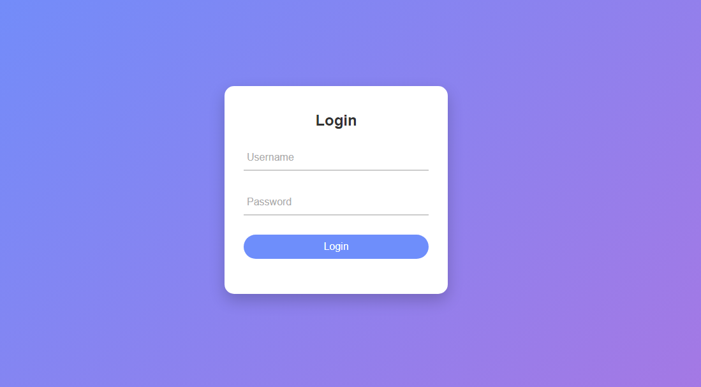

# 🔐 Animated Login Form

This is an interactive login form created using **HTML, CSS, and JavaScript**. It is beginner-friendly and focuses on modern form animations, real-time validation, and a clean, responsive design.

## 📸 Preview

## ✨ Features

* Floating labels and underline animations
* Real-time validation for empty fields
* Dynamic success/error messages
* Page refresh on login (stays on the same page)
* Responsive and clean design
* Beginner-friendly HTML, CSS & JS code

## 🚀 Live Demo

[View the page here](https://sania-arooj.github.io/animated-login-form/)

## 🚀 How to Use

1. Open `index.html` in your browser
2. Enter any username and password (no restrictions)
3. Click **Login** to see success message and page refresh

## 📂 Technologies Used

* HTML5
* CSS3
* JavaScript

## 👩‍💻 Author

**Sania Arooj** 🎓 BSCS Student
💻 Learning Front-End Development & UI/UX
🌱 Passionate about coding

